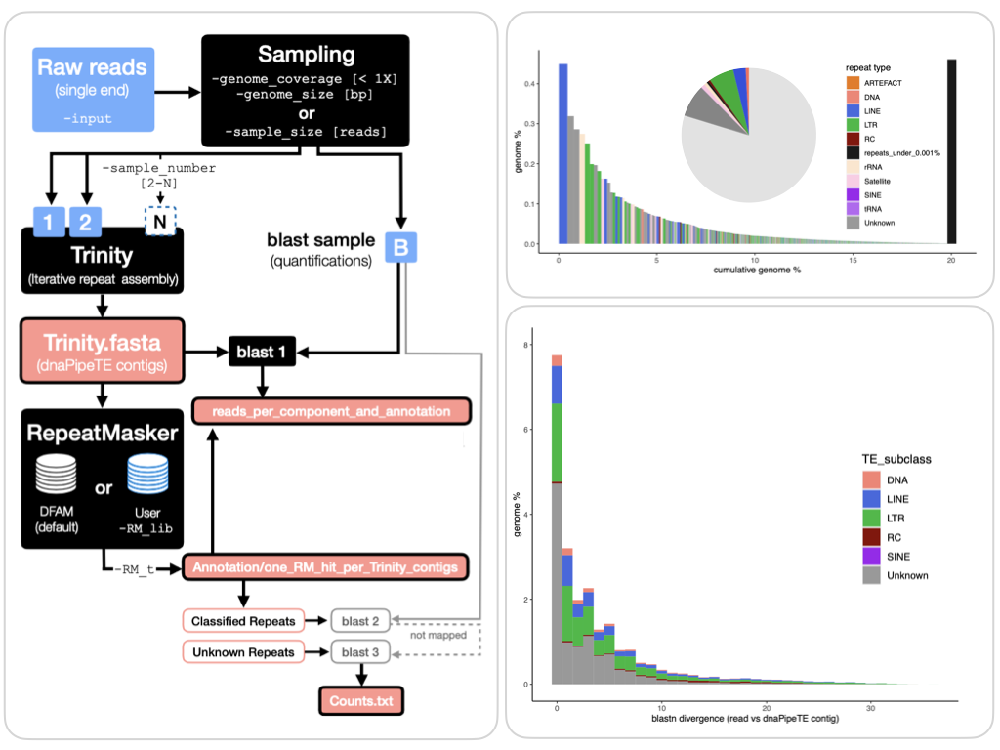

# dnaPipeTE []() []() [](https://doi.org/10.1093/gbe/evv050)

dnaPipeTE (for **d**e-**n**ovo **a**ssembly & annotation **Pipe**line for **T**ransposable **E**lements), is a pipeline designed to find, classify and quantify Transposable Elements and other repeats in low coverage (< 1X) NGS datasets.
It is very useful to quantify the proportion of TEs in newly sequenced genomes since it **does not require genome assembly** and works directly on **raw short-reads.**

- :family: dnaPipeTE was created in 2015 by **[Clément Goubert](@clemgoub)** and **[Laurent Modolo](@l-modolo)** at the [LBBE](http://lbbe.univ-lyon1.fr/), with the latter contributions of **Romain Lannes (@rLannes)**, **@pauram** and 
**T. Mason Linscott**. Thanks a lot!
- :package: The container version has been made possible thanks to **Stéphane Delmotte** of the LBBE.
	- The current version of dnaPipeTE is **v.1.4c "container"** and is available through Docker/Singularity (see [Installation](#installation)). Changelogs can be found [here](#changelog).<br>
	- **From now on, only the container versions of dnaPipeTE will have support**. Thank you for your understanding! Container versions are stored on the [Docker Hub](https://hub.docker.com/repository/docker/clemgoub/dnapipete/general).
	- The last non-container version of dnaPipeTE 1.3.1 is available [here](https://github.com/clemgoub/dnaPipeTE/tree/vers1.3).
- :page_facing_up: You can read the [original publication in GBE](https://academic.oup.com/gbe/article/7/4/1192/533768)
- :bar_chart: A companion repository [dnaPT_utils](https://github.com/clemgoub/dnaPT_utils) provides useful scripts for post-processing and to create customizable figures. It requires a UNIX environment with `bash`, `R` and `cd-hit`. It is not required for execution of dnaPipeTE. 
	> dnaPT_utils has been added to the latest distribution (v1.4c).

- :stethoscope: If you encounter some issues with dnaPipeTE, you can [request assistance here](https://github.com/clemgoub/dnaPipeTE/issues)!
- :teacher: An introductory tutorial to dnaPipeTE is available on the [TE-hub](https://tehub.org/en/tutorials/docs/dnaPipeTE)



***********************


## Installation

### System requirement

dnaPipeTE can now run on **any system compatible with Docker or Singularity**. It is recommended to have a minimum of 16Go or RAM, and multiple cpus will improve the execution speed.

Trinity (used for the repeats' assembly) can use a lot of RAM! Here are some examples of RAM usages:

- 100,000 reads \~10 Go RAM (two Trinity iterations)
- 3,000,000 reads \~40 Go RAM (two Trinity iterations)

### Docker (root users)

Docker must be installed and running on the execution machine. For more details see https://docs.docker.com/get-docker/.
Then, download the dnaPipeTE container:
```shell
sudo docker pull clemgoub/dnapipete:latest
```

### Singularity/Apptainer (non-root users, HPC,...)

For users of High Performance Clusters (HPC) and other system with no root privileges, it is recommended to use Singularity (usualy provided with the base software; for more information see https://sylabs.io/guides/3.0/user-guide/installation.html).

To use dnaPipeTE with Singularity you need to create an image of the container on your machine. 

```shell
mkdir ~/dnaPipeTE
cd ~/dnaPipeTE
singularity pull --name dnapipete.img docker://clemgoub/dnapipete:latest
```
> This step takes \~20 minute to build the image, and is only required once.

## Running dnaPipeTE

Create a project folder

```shell
mkdir ~/Project
cd Project
```

`~/Project` will be mounted into the `/mnt` directory of the Docker or Singularity container and will contain the inputs and outputs.

### Input File

The input file must be a **single-end FASTQ or FASTQ.GZ** file of NGS reads. It can be either the R1 or R2 end of a paired-end library. dnaPipeTE performs the sampling automatically, so you can provide a large file (> 1X) as input.

>**IMPORTANT: We recommend to remove mitochondrial DNA and other non-nuclear DNA from your reads (symbionts, virus, contaminants). If mtDNA reads are left in the samples, the mitochondrial genome will be assembled and will appear as one of the most abundant repeat in the output for a size of \~10kb (it may also be wrongly classified as TE!).**

For the following examples, we will consider a fictitious read file called `reads_input.fastq`

### Interactive usage

#### Docker

```shell
# start the dnaPipeTE container
sudo docker run -it -v ~/Project:/mnt clemgoub/dnapipete:latest
```

Once in the container, run:

```shell
python3 dnaPipeTE.py -input /mnt/reads_input.fastq -output /mnt/output -RM_lib ../RepeatMasker/Libraries/RepeatMasker.lib -genome_size 170000000 -genome_coverage 0.1 -sample_number 2 -RM_t 0.2 -cpu 2
```

#### Singularity 

```shell
singularity shell --bind ~Project:/mnt ~/dnaPipeTE/dnapipete.img
````

Once in the container, run:

```shell
python3 dnaPipeTE.py -input /mnt/reads_input.fastq -output /mnt/output -RM_lib ../RepeatMasker/Libraries/RepeatMasker.lib -genome_size 170000000 -genome_coverage 0.1 -sample_number 2 -RM_t 0.2 -cpu 2
```

### Batch file usage

We create a file `dnaPT_cmd.sh` that will contain the dnaPipeTE command:

```shell
#! /bin/bash 
python3 dnaPipeTE.py -input /mnt/reads_input.fastq -output /mnt/output -RM_lib ../RepeatMasker/Libraries/RepeatMasker.lib -genome_size 170000000 -genome_coverage 0.1 -sample_number 2 -RM_t 0.2 -cpu 2 
```
> the shebang (`#! bin/bash`) is required to tell the container which program we want to execute our script

#### Docker

```shell
sudo docker run -v ~Project:/mnt clemgoub/dnapipete:latest ./mnt/dnaPT_comd.sh
```
#### Singularity

```shell
singularity exec --bind ~Project:/mnt ~/dnaPipeTE/dnapipete.img /mnt/dnaPipeTE_cmd.sh
```

### dnaPipeTE arguments

|Argument|Description|
|---|---|
|-input | input fastq or fastq.gz files (single end only). It will be sampled |
|-output | complete path with name for the outputs |  
|-cpu | maximum number of cpu to use |
|-sample_number | number of trinity iterations |
|-genome_size | size of the genome [use it with -genome_coverage; if used, do not use -sample_size] Ex. 175000000 for 175Mb |
|-genome_coverage | coverage of the genome for each sample [use it with -genome_size; if used, do not use -sample_size] Ex: 0.1 for 0.1X coverage per sample |
|-sample_size | number of reads to sample [use without -genome_size and -genome_coverage] |
|-RM_lib | path to repeat library for RepeatMasker. By default use `../RepeatMasker/Libraries/RepeatMasker.lib`. For a custom library, the header format must follow: `>Repeat_name#CLASS/Subclass` with CLASS in "DNA, LINE, LTR, SINE, MITE, Helitron, Simple Repeat, Satellite"|
|-RM_t | Annotation threshold: minimal percentage of the query (dnaPipeTE contig) aligned on the repeat to keep the annotation from RepeatMasker. Ex: 0.2 for 20% of query in db |
|-keep_Trinity_output | Keep Trinity output files at the end of the run. Default files are removed (large and numerous).|
|-contig_length | minimum size of a repeat contig to be retained (default 200bp) |

**Continuing a crashed run:**
dnaPipeTE is able to skip some steps if a run crashes after a checkpoint. For example, if it crashes during the Trinity assembly, the sampling won't be performed again if you launch the run again **in the same output folder**. The checkpoints are 1-sampling of Trinity inputs; 2- Trinity assembly.

## dnaPipeTE OUTPUTS

dnaPipeTE produces a lot of outputs, some of them are very interesting!

The output folder is divided into the following parts:

- **main folder (output name):**

**important files:**

|File|Description|
|---|---|
| "Trinity.fasta" | this file contains the dnaPipeTE contigs, this is the last assembly performed with Trinity |
| "reads\_per\_component\_and\_annotation" | table with the count of reads and bp aligned per dnaPipeTE contigs (from blastn 1), as well as its best RepeatMasker annotation. <ul><li>1: counts (#reads)</li><li>2: aligned bases</li><li>3 dnaPipeTE contig name</li><li>4 Repeat Masker hit length (bp)</li><li>5 RepeatMakser annotation</li><li>6 RM classification</li><li>7 hit length / dnaPipeTE contig length</li></ul> |

**less important files you may like:**

|File|Description|
|---|---|
|"Trinity.fasta.out" | raw RepeatMasker output (not sorted) of Trinity.fasta on the repeat libraries.|
|"Counts.txt"| count of bp of the sample aligned for each TE class (used for the pieChart)|
|"Reads\_to\_components\_Rtable.txt"| input file to compute the reads and bp per contig (one line per reads)|
|"Bases\_per\_component.pdf/png" | graph with the number of base-pairs aligned on each dnaPipeTE contig (from blast 1), ordered by genome proportion of the dnaPipeTE contig. -- however, see [dnaPT_utils](https://github.com/clemgoub/dnaPT_utils) improved graphs|
| "pieChart.pdf/png" | graph with the relative proportion of the main repeat classes, informs about the estimated proportion of repeats in the genome (from blastn 2 and 3) -- however, see: [dnaPT_utils](https://github.com/clemgoub/dnaPT_utils) for improved graphs |
|"reads_landscape"| reads used for the landscape graph, including the blastn divergence from one reads to the contig on which it maps. To plot the landscape, see [dnaPT_utils](https://github.com/clemgoub/dnaPT_utils)|


- **"Annotation" folder:**

**important files:**

|File|Description|
|---|---|
| "one_RM_hit_per_Trinity_contigs"| sorted RepeatMasker output containing the best hit on the repeat library for each of the dnaPipeTE contigs (Trinity.fasta)|
| | <ul><li>1: dnaPipeTE contig name</li><li>2: hit length on dnaPipeTE contig</li><li>3: proportion of dnaPipeTE contig covered by hit</li><li>4: hit name</li><li>5: hit classification</li><li>6: hit target length</li><li>7: hit coordinates on target</li><li>8: proportion of target covered by the hit </li></ul> |

**less important files you may like:**

| "Best_RM_annot_80_80"| subset of the previous table, including contigs for which at least 80% of the sequence is mapping to at least 80% percent of the target sequence.|
| "Best_RM_annot_partial"| same but for contigs for which at least 80% of the sequence is mapping to less than 80% percent of the target sequence|
|"[repeat-class].fasta"| subsets of the Trinity.fasta file for each repeat type detected by RepeatMasker|
|"unannotated.fasta"| subsets of the Trinity.fasta for contigs that didn't find any match...|

- **"blast_out" folder:**

**important files:**

|File|Description|
|---|---|
|"sorted.reads_vs_Trinity.fasta.blast.out"| best hit per reads from blastn 1|
|"sorted.reads_vs_annotated.blast.out"| best hit per reads from blastn 2|
|"sorted.reads_vs_unannotated.blast.out"| best hit per reads from blastn 3|

**less important files you may like:**

|File|Description|
|---|---|
|"reads_vs_[anything]"| raw blast out from previous files|
|Trinity_runX | Those files contains the raw Trinity outputs and intermediates files produced during assembly steps. For futher detail see the Trinity documentation (http://trinityrnaseq.sourceforge.net/) |


## Changelog

**Changelog v1.4c** 
Oct.2022

- Update RepeatMasker to v.4.1.3
- Update R from 3.3.3 to 4.2.1
- Fix issues #12, #55 and #73 (thanks to T. Mason Linscott)
- Adds `dnaPT_utils` to the container

***********************
**Changelog v1.3.1c** 
March.2022

- First container version
- `dnaPipeTE.py`
	- The docker-specific config.ini has to be used.
	- blast2: the database (annotated dnaPipeTE contigs) is not merged with Repbase anymore for this blast, as Repbase in not freely accessible anymore. This was in case low-copy TE were missed but present in Repbase, they could be saved. However there is virtually no influence on the results.

***********************
**Changelog v1.3.1**
07.Dec.2017

- Fixed missing class column for some Academ families causing errors with landscape graphs (thanks @rotifergirl for reporting!)

***********************
**Changelog v1.3**
01.Dec.2017

- Updated Trinity with latest version (v2.5.1)
- Updated RepeatMasker with latest version (version Open 4.0.7)
- Compatible with latest Repbase (RepeatMasker compatible) libraries (20170127)
- fix bug for the blast sample wich turned out to be a reclycling of the sample 1 instead of a new independant sample. Howerver, test showed this had no striking influence on the results (actual sampling variation between runs is more likely to create variation between outputs).
- remove most of the files from the `bin` folder and replace it with the `init.sh` script so that user can make their own installation.
- Landscape graph are now expressed relative to genome %
- Clean git repository of larges files

*You can download previous version on the github repository, clicking on "branch" menu and selecting the desired version*

***********************
**Changelog v1.2**

- Estimation of repeat content is now performed on the ratio of aligned bases (bp) on repeat contig over the total number of base sampled, instead of the number of reads mapping / total of read sampled; this produces a better estimate of the repeat content and reduces potential overestimations. In addition, it allows more accurate estimates if the size of reads used as input is variable. ![changes-1.1_1.2]
- If different part of one same read match different repeats contigs (e.g. in case adjacent TEs or TE in TE), all bases are retained instead only the one of the best hit.
- New graph "Bases per component" replaces "reads per component"; is very similar to reads per component graph but represent the total amount of bases aligned over the dnaPipeTE contigs.
- Bug fix: in last version, repbase library was not merged to annotated dnaPipeTE contigs for repeat estimates, now it is.
- New option: "-Trin_glue" to specify a minimum number of reads supporting the joining of kmer contigs during assembly (Chrysalis step in trinity)
- New option: "-contig_length" to set a minimum size (in bp) to report a contig (default is 200 bp)

***********************
